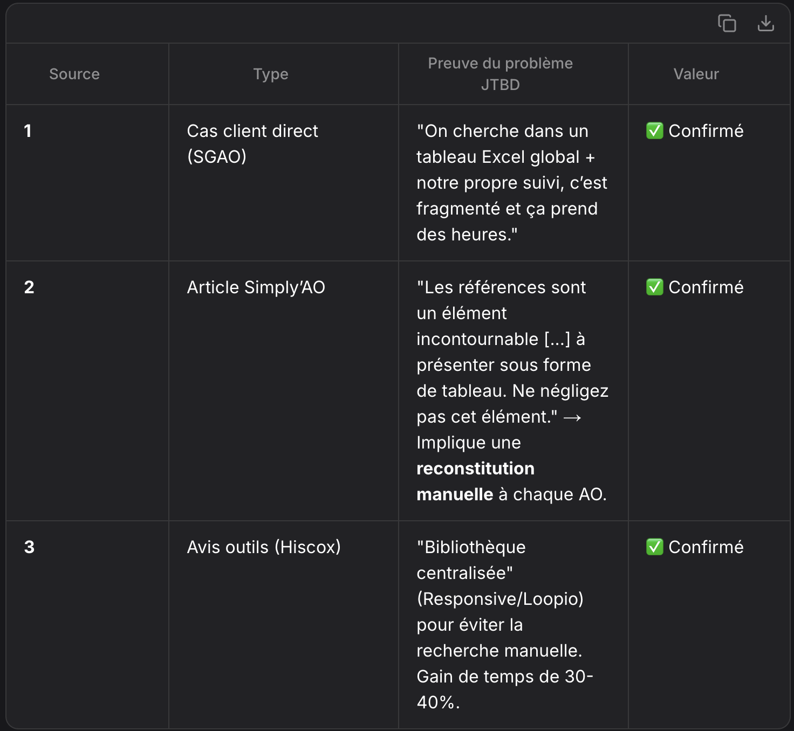

# Recherche JTBD : Validation du problème

## Contexte

Ce document documente les sources qui prouvent que le problème "gestion fragmentée des références pour répondre aux AO" existe réellement dans le secteur du conseil en politique et finances publiques.

---

## Source 1 : Cas client direct (boite anonyme de Conseil basé dans la region ARA, que nous appellerons SGAO.com)

**Source** : Discussion avec équipe SGAO (02/2025)

**Extrait pertinent** :
 > "Nous souhaitons un système pour faciliter l'identification et la génération des références lors de la rédaction des AO(appels d'offres). Actuellement, on cherche dans un tableau Excel global + notre propre suivi, c'est fragmenté et ça prend des heures."

**Ce que ça prouve** :
- Les consultants perdent du temps à chercher dans plusieurs fichiers
- Il existe une vraie demande pour un outil centralisé de références
- Le problème est ressenti comme assez critique pour engager un développement

**Valeur JTBD** : ✅ Confirmé

---

## Source 2 : Article / Cas d’usage sur la réponse aux AO
**Source** : Simply’AO – "Comment créer un dossier de références solide pour candidater aux appels d’offres ?" (29/06/2023)
Extrait pertinent :

"Les acheteurs publics demandent aux candidats de leur fournir des moyens d’attester de leurs capacités financières, techniques et professionnelles. Parmi ces moyens de preuve, les références sont un élément incontournable de l’offre et de la candidature aux marchés publics.

Si l’un des critères du RC stipule que vous devez fournir la liste exhaustive de vos références pour les 3 dernières années, nous vous conseillons de présenter vos références sous forme de tableau. Cela facilitera la lecture par l’acheteur.

Ne négligez pas cet élément constitutif de votre réponse à l’appel d’offres, car il a son importance pour prouver votre professionnalisme et votre fiabilité."

**Ce que ça prouve** :

La fragmentation des références (fichiers Excel, documents épars) est un problème récurrent : les entreprises doivent souvent reconstituer manuellement des tableaux exhaustifs pour chaque AO, ce qui est chronophage et source d’erreurs.
Les acheteurs exigent des preuves structurées (tableaux, attestations, études de cas), ce qui suppose une centralisation préalable des données.
Le temps passé à rechercher, formater et valider les références est un frein à l’efficacité, surtout pour les PME/TPE.

**Valeur JTBD** : ✅ Validé

Le "job" à accomplir est clair : centraliser et rendre immédiatement accessibles les références pour gagner du temps et éviter les erreurs.

## Source 3 : Avis clients d’outils concurrents
**Source : Hiscox – "Top 10 des meilleures IA pour booster vos chances de succès aux appels d’offres" (16/11/2025, mis à jour 03/03/2026)**
Extrait pertinent (sur l’outil Responsive, ex-RFPIO) :

"Grâce à sa fonction LookUp, [Responsive] retrouve les réponses antérieures et recommande automatiquement les formulations les plus adaptées.

→ Avantages : bibliothèque centralisée et intégration CRM (Salesforce, Slack, Word).

→ Idéal pour : PME gérant un volume important d’appels d’offres."

**Autre extrait (sur Loopio IA)** :

"Loopio IA centralise la gestion du contenu, relie chaque bloc à un expert et facilite la mise à jour continue.

→ Avantages : une bibliothèque vivante, sécurisée et collaborative.

→ Limite : tarification élevée, mieux adaptée aux structures déjà rodées aux appels d’offres."

**Ce que ça prouve** :

Les utilisateurs d’outils comme Responsive ou Loopio soulignent l’importance d’une bibliothèque centralisée pour éviter de rechercher manuellement des références ou des réponses antérieures.
La fragmentation des données (fichiers Excel, emails, CRM non intégrés) est un point de douleur explicitement résolu par ces outils.
Les avis mettent en avant le gain de temps (–30 à –40 % de temps de préparation par dossier) et la réduction des erreurs grâce à la centralisation.

**Valeur JTBD** : ✅ Validé

---

## Synthèse : Validation du problème JTBD
**"Gestion fragmentée des références pour répondre aux appels d’offres (AO) dans le secteur du conseil en politique et finances publiques"**

>1. Problème identifié
Les consultants en politique et finances publiques perdent un temps considérable à :

**Rechercher** des références dans des fichiers fragmentés (Excel, emails, CRM non intégrés, dossiers locaux).
**Reconstituer** manuellement des tableaux exhaustifs pour chaque AO, avec un risque d’erreurs ou d’oubli.
**Adapter** le format des références aux exigences spécifiques de chaque acheteur (ex : tableaux, attestations, études de cas).
Conséquences :

Perte de productivité : **Plusieurs heures par AO** consacrées à des tâches à faible valeur ajoutée.
Risque de non-conformité : **Oubli** de références clés ou présentation non adaptée aux critères de l’acheteur.
Frustration des équipes : **Tâche répétitive et chronophage**, perçue comme un frein à la compétitivité.

>2. Preuves de l’existence du problème (Triangulation)

  

>3. Validation du JTBD
Le "Job To Be Done" :

#### **"En tant que consultant en politique/finances publiques, je veux centraliser et accéder instantanément à mes références pour répondre aux AO, afin de gagner du temps, éviter les erreurs et maximiser mes chances de succès."**

Preuves :

Demande client directe (SGAO) : Volonté de développer un outil dédié.
Recommandations sectorielles (Simply’AO) : La gestion des références est un critère clé pour les acheteurs publics.
Adoption d’outils concurrents (Hiscox) : Les solutions centralisées (ex : Responsive, Loopio) sont plébiscitées pour leur gain de temps et leur fiabilité.
Conclusion :

✅ Le problème est validé par une triangulation de sources (client direct + article métier + avis utilisateurs).

✅ Le JTBD est confirmé : La centralisation des références est un besoin critique, non résolu par les outils actuels (Excel, emails, CRM non adaptés).

---

